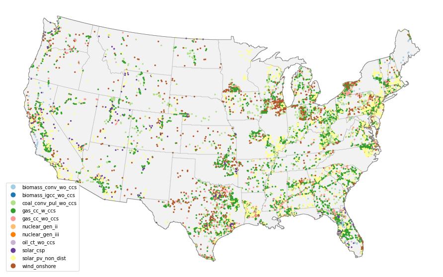

==========
Quickstart
==========

This walkthrough exercises the main functionality of the **cerf** package using the example data, which is meant for
illustrative purposes only. **cerf** runs from a single YAML configuration file that contains project and
technology-specific settings, an electricity capacity expansion plan, and LMP zone pricing data, all described in
detail in the :doc:`user_guide`. Expansion plans and technology data are generally generated by models such as GCAM
which capture multi-sector dynamics that represent alternate futures based on scenario assumptions for socioeconomics,
radiative forcing, etc. The **cerf** package also comes equipped with power plant siting suitability data at a 1 km
resolution over the CONUS, publicly available data from EIA and HIFLD for transmission and pipeline infrastructure, and
generic 8760 locational marginal pricing similar to what you could model using your preferred grid operations model.

The same tutorial is available as a Jupyter notebook: `notebooks/quickstarter.ipynb
<https://github.com/IMMM-SFA/cerf/blob/main/notebooks/quickstarter.ipynb>`_.

Load packages and install package data
--------------------------------------

.. code-block:: python

   import cerf

   # one-time download of the sample data (about 195 MB); see Getting started for options
   cerf.install_package_data()

Site power plants for a single year
-----------------------------------

.. code-block:: python

   # sample year
   yr = 2030

   # load the sample configuration file path for the target year
   config_file = cerf.config_file(yr)

   # run the configuration for the target year and return a data frame
   result_df = cerf.run(config_file, write_output=False)

**cerf** logs its progress: staging (LMP, interconnection, NOV, NLC, suitability) followed by one line per region as it
is processed. The full CONUS sample stages in a few seconds and sites all 49 regions in about two seconds on a laptop.

**Results are returned as a pandas DataFrame.** Each record is a sited power plant having a geographic location and
other siting attributes. **cerf** uses the ``USA_Contiguous_Albers_Equal_Area_Conic`` projected coordinate reference
system in its CONUS example data, so ``xcoord`` and ``ycoord`` are relative to that projection.

.. code-block:: python

   result_df.head()

Every column is described in :ref:`Key outputs`.

.. tip::

   You can also load the sample configuration as a dictionary, modify it, and pass it with ``config_dict=`` instead
   of a file path - convenient for scenario sweeps:

   .. code-block:: python

      config = cerf.load_sample_config(2030)
      config["expansion_plan"]["virginia"][9]["n_sites"] = 4

      result_df = cerf.run(config_dict=config, write_output=False)

Site power plants for multiple years
------------------------------------

This exercise demonstrates how to inherit sites from a previous year's results and keep them in the mix if they have
not yet reached retirement. If this is done in **cerf**, users should ensure that their expansion plan is only for new
vintage each time step.

.. code-block:: python

   import cerf

   # process year 2010, 2030, and 2050
   for index, yr in enumerate([2010, 2030, 2050]):

       print(f"\nProcessing year:  {yr}")

       # load the sample configuration file path for the target year
       config_file = cerf.config_file(yr)

       # do not initialize the run with previously sited data if it is the first time step
       if index == 0:
           result_df = cerf.run(config_file, write_output=False)

       else:
           result_df = cerf.run(config_file, write_output=False, initialize_site_data=result_df)

Plants carried over from an earlier year keep their original ``sited_year`` and occupy their cells and buffers until
``retirement_year`` (``sited_year + operational_life_yrs``) is reached; retired plants are dropped before the next
year is sited.

**Explore the results that account for retirement.** Since we inherited each year, and we are only siting new vintage
per year, we see power plants from multiple vintages until they reach their retirement age. We can narrow in on
biomass power plants in Virginia to see this:

.. code-block:: python

   result_df.loc[(result_df['region_name'] == 'virginia') & (result_df['tech_id'] == 9)]

**Plot the output**

.. code-block:: python

   cerf.plot_siting(result_df)

``plot_siting`` accepts any result data frame, a ``column`` to colour by, a colormap, and ``save_figure`` /
``output_file`` to write the figure to disk. Custom boundary and region shapefiles can be supplied for non-CONUS runs.

Reproducible runs
-----------------

When several cells tie for the lowest Net Locational Cost, **cerf** picks one at random. Set ``randomize: False`` and a
``seed_value`` in the ``settings`` section of the configuration to make a run repeatable:

.. code-block:: python

   config = cerf.load_sample_config(2010)
   config["settings"]["randomize"] = False
   config["settings"]["seed_value"] = 0

   result_a = cerf.run(config_dict=config, write_output=False)
   result_b = cerf.run(config_dict=config, write_output=False)

   assert result_a.equals(result_b)

The random state is local to each region's competition, so a seeded result is identical regardless of the
parallel backend or the order in which regions are processed.

Running regions in parallel
---------------------------

Regions are independent, so they can be processed concurrently with any `joblib
<https://joblib.readthedocs.io/en/stable/parallel.html>`_ backend:

.. code-block:: python

   # threads share the staged arrays in memory; fast and deterministic when seeded
   result_df = cerf.run(config_dict=config, write_output=False, method="threading", n_jobs=4)

   # separate processes; each region is cropped to its bounding box before dispatch
   result_df = cerf.run(config_dict=config, write_output=False, method="loky", n_jobs=-1)

``n_jobs=-1`` uses all processors and ``-2`` all but one, following joblib. The default ``method="sequential"`` is
the simplest choice for the sample data; ``threading`` is the fastest for a single machine, and the process backends
(``loky``, ``multiprocessing``) are useful when a downstream step is CPU-bound in pure Python.

Running a single region
-----------------------

To inspect one region in detail, or to integrate **cerf** into your own orchestration, use the ``Model`` class
directly:

.. code-block:: python

   model = cerf.Model(config_dict=config)

   region = model.run_single_region("virginia", write_output=False)

   region.run_data.sited_df        # sited plants for the region
   region.run_data.sited_array     # 2D array of technology IDs for the region's bounding box

Lower-level building blocks (``Stage``, ``RegionData``, ``ProcessRegion``, ``Competition``) are documented in the
:doc:`api`.

Running the quickstarter locally
--------------------------------

You can download the **cerf** quickstarter Jupyter notebook here: `cerf quickstarter
<https://github.com/IMMM-SFA/cerf/blob/main/notebooks/quickstarter.ipynb>`_. This will allow you to run the tutorial
interactively on your local computer. Installation instructions for Jupyter can be found `here
<https://jupyter.org/install>`_.

Once you have Jupyter up and running, make sure you install **cerf** and its package data by running:

.. code-block:: bash

   python3 -m pip install cerf

   python3 -c 'import cerf; cerf.install_package_data()'

where ``python3`` is the instance of Python that you installed Jupyter on. Now you are ready to explore **cerf**.
