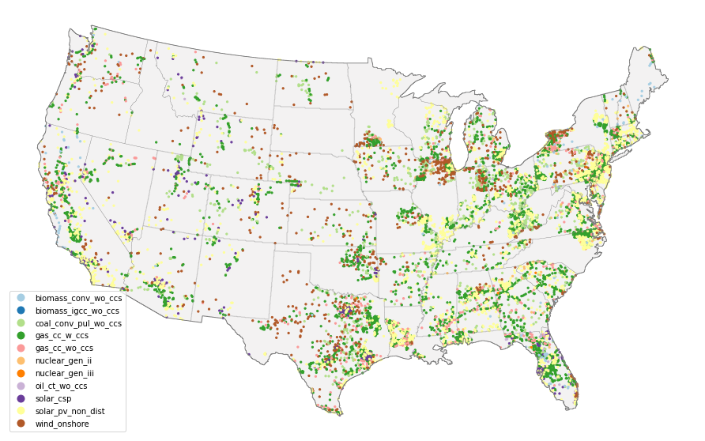

Load packages
^^^^^^^^^^^^^

.. code:: ipython3

    import cerf

Install package data
^^^^^^^^^^^^^^^^^^^^

**NOTE**:  The package data will require approximately 195 MB of storage.

Ensure that you have installed the package data using:

.. code:: ipython3

    cerf.install_package_data()

Conduct a run with CERF
^^^^^^^^^^^^^^^^^^^^^^^

We will be exploring the main functionality of the ``cerf`` package
using our our example data which is meant for illustrative purposes only.
``cerf`` runs using a single YAML configuration file that contains
project and technology-specific settings, an electricity capacity
expansion plan, and LMP zones pricing data which is described in detail
in the docs `here <https://immm-sfa.github.io/cerf/>`__. Expansion plans
and technology data are generally generated by models such as GCAM
which capture multi-sector dynamics that represent alternate futures
based on scenario assumptions for socioeconomics, radiative forcing,
etc. The ``cerf`` package also comes equipped with power plant siting suitability
data at a 1-km resolution over the CONUS, publically available data from EIA and
HIFLD for transmission and pipeline infrastructure, and generic 8760 locational
marginal pricing similar to what you could model using your prefered grid
operations model.

Run ``cerf`` to site power plants in an expansion plan for a single year for the CONUS
^^^^^^^^^^^^^^^^^^^^^^^^^^^^^^^^^^^^^^^^^^^^^^^^^^^^^^^^^^^^^^^^^^^^^^^^^^^^^^^^^^^^^^^^^

.. code:: ipython3

    # sample year
    yr = 2030

    # load the sample configuration file path for the target year
    config_file = cerf.config_file(yr)

    # run the configuration for the target year and return a data frame
    result_df = cerf.run(config_file, write_output=False)

.. parsed-literal::

    2021-08-24 11:44:03,734 - root - INFO - Starting CERF model
    2021-08-24 11:44:03,956 - root - INFO - Staging data...
    2021-08-24 11:44:04,168 - root - INFO - Using 'zones_raster_file':  /Users/d3y010/repos/github/cerf/cerf/data/lmp_zones_1km.img
    2021-08-24 11:44:04,203 - root - INFO - Processing locational marginal pricing (LMP)
    2021-08-24 11:44:04,203 - root - INFO - Using LMP from default illustrative package data:  /Users/d3y010/repos/github/cerf/cerf/data/illustrative_lmp_8760-per-zone_dollars-per-mwh.zip
    2021-08-24 11:44:13,798 - root - INFO - Calculating interconnection costs (IC)
    2021-08-24 11:44:13,798 - root - INFO - Using default substation costs from file: /Users/d3y010/repos/github/cerf/cerf/data/costs_per_kv_substation.yml
    2021-08-24 11:44:13,802 - root - INFO - Using default substation file: /Users/d3y010/repos/github/cerf/cerf/data/hifld_substations_conus_albers.zip
    2021-08-24 11:44:21,669 - root - INFO - Using default gas pipeline file:  /Users/d3y010/repos/github/cerf/cerf/data/eia_natural_gas_pipelines_conus_albers.zip
    2021-08-24 11:44:22,938 - root - INFO - Using gas pipeline costs from default file:  /Users/d3y010/repos/github/cerf/cerf/data/costs_gas_pipeline.yml
    2021-08-24 11:44:29,649 - root - INFO - Calculating net operational cost (NOV)
    2021-08-24 11:44:30,783 - root - INFO - Calculating net locational cost (NLC)
    2021-08-24 11:44:31,325 - root - INFO - Building suitability array
    2021-08-24 11:44:31,749 - root - INFO - Using suitability file for 'biomass_conv_wo_ccs':  /Users/d3y010/repos/github/cerf/cerf/data/suitability_biomass.sdat
    2021-08-24 11:44:31,789 - root - INFO - Using suitability file for 'biomass_igcc_wo_ccs':  /Users/d3y010/repos/github/cerf/cerf/data/suitability_biomass_igcc.sdat
    2021-08-24 11:44:31,825 - root - INFO - Using suitability file for 'coal_conv_pul_wo_ccs':  /Users/d3y010/repos/github/cerf/cerf/data/suitability_coal.sdat
    2021-08-24 11:44:31,852 - root - INFO - Using suitability file for 'gas_cc_wo_ccs':  /Users/d3y010/repos/github/cerf/cerf/data/suitability_gas_cc.sdat
    2021-08-24 11:44:31,881 - root - INFO - Using suitability file for 'gas_cc_w_ccs':  /Users/d3y010/repos/github/cerf/cerf/data/suitability_gas_cc_ccs.sdat
    2021-08-24 11:44:31,908 - root - INFO - Using suitability file for 'nuclear_gen_ii':  /Users/d3y010/repos/github/cerf/cerf/data/suitability_nuclear.sdat
    2021-08-24 11:44:31,935 - root - INFO - Using suitability file for 'nuclear_gen_iii':  /Users/d3y010/repos/github/cerf/cerf/data/suitability_nuclear.sdat
    2021-08-24 11:44:31,963 - root - INFO - Using suitability file for 'oil_ct_wo_ccs':  /Users/d3y010/repos/github/cerf/cerf/data/suitability_oil_baseload.sdat
    2021-08-24 11:44:31,989 - root - INFO - Using suitability file for 'solar_csp':  /Users/d3y010/repos/github/cerf/cerf/data/suitability_solar.sdat
    2021-08-24 11:44:32,015 - root - INFO - Using suitability file for 'solar_pv_non_dist':  /Users/d3y010/repos/github/cerf/cerf/data/suitability_solar.sdat
    2021-08-24 11:44:32,042 - root - INFO - Using suitability file for 'wind_onshore':  /Users/d3y010/repos/github/cerf/cerf/data/suitability_wind.sdat
    2021-08-24 11:44:32,069 - root - INFO - Staged data in 28.1118519 seconds
    2021-08-24 11:44:33,086 - root - INFO - Processed `alabama` in 1.0166159 seconds
    2021-08-24 11:44:34,387 - root - INFO - Processed `arizona` in 1.3004961 seconds
    2021-08-24 11:44:34,920 - root - INFO - Processed `arkansas` in 0.531682 seconds
    2021-08-24 11:44:39,114 - root - INFO - Processed `california` in 4.19344 seconds
    2021-08-24 11:44:39,809 - root - INFO - Processed `colorado` in 0.6944351 seconds
    2021-08-24 11:44:39,956 - root - INFO - Processed `connecticut` in 0.1455598 seconds
    2021-08-24 11:44:40,040 - root - INFO - Processed `delaware` in 0.083498 seconds
    2021-08-24 11:44:40,114 - root - INFO - Processed `district_of_columbia` in 0.0735919 seconds
    2021-08-24 11:44:41,768 - root - INFO - Processed `florida` in 1.6528592 seconds
    2021-08-24 11:44:42,681 - root - INFO - Processed `georgia` in 0.9123399 seconds
    2021-08-24 11:44:43,257 - root - INFO - Processed `idaho` in 0.5753481 seconds
    2021-08-24 11:44:44,108 - root - INFO - Processed `illinois` in 0.8507626 seconds
    2021-08-24 11:44:44,496 - root - INFO - Processed `indiana` in 0.3873999 seconds
    2021-08-24 11:44:45,108 - root - INFO - Processed `iowa` in 0.610285 seconds
    2021-08-24 11:44:45,625 - root - INFO - Processed `kansas` in 0.5162001 seconds
    2021-08-24 11:44:46,092 - root - INFO - Processed `kentucky` in 0.46629 seconds
    2021-08-24 11:44:46,929 - root - INFO - Processed `louisiana` in 0.8366458 seconds
    2021-08-24 11:44:47,207 - root - INFO - Processed `maine` in 0.276648 seconds
    2021-08-24 11:44:47,427 - root - INFO - Processed `maryland` in 0.2200139 seconds
    2021-08-24 11:44:47,603 - root - INFO - Processed `massachusetts` in 0.1754241 seconds
    2021-08-24 11:44:48,601 - root - INFO - Processed `michigan` in 0.9966919 seconds
    2021-08-24 11:44:49,403 - root - INFO - Processed `minnesota` in 0.8013589 seconds
    2021-08-24 11:44:50,051 - root - INFO - Processed `mississippi` in 0.6468239 seconds
    2021-08-24 11:44:50,769 - root - INFO - Processed `missouri` in 0.7176321 seconds
    2021-08-24 11:44:51,607 - root - INFO - Processed `montana` in 0.83709 seconds
    2021-08-24 11:44:52,010 - root - INFO - Processed `nebraska` in 0.4028261 seconds
    2021-08-24 11:44:53,065 - root - INFO - Processed `nevada` in 1.0537767 seconds
    2021-08-24 11:44:53,235 - root - INFO - Processed `new_hampshire` in 0.169647 seconds
    2021-08-24 11:44:53,436 - root - INFO - Processed `new_jersey` in 0.1997998 seconds
    2021-08-24 11:44:54,095 - root - INFO - Processed `new_mexico` in 0.659168 seconds
    2021-08-24 11:44:55,054 - root - INFO - Processed `new_york` in 0.9580491 seconds
    2021-08-24 11:44:55,747 - root - INFO - Processed `north_carolina` in 0.6923168 seconds
    2021-08-24 11:44:56,122 - root - INFO - Processed `north_dakota` in 0.3739688 seconds
    2021-08-24 11:44:56,679 - root - INFO - Processed `ohio` in 0.5559881 seconds
    2021-08-24 11:44:57,555 - root - INFO - Processed `oklahoma` in 0.8756032 seconds
    2021-08-24 11:44:58,328 - root - INFO - Processed `oregon` in 0.7727861 seconds
    2021-08-24 11:44:59,067 - root - INFO - Processed `pennsylvania` in 0.7384419 seconds
    2021-08-24 11:44:59,145 - root - INFO - Processed `rhode_island` in 0.0770929 seconds
    2021-08-24 11:44:59,585 - root - INFO - Processed `south_carolina` in 0.438771 seconds
    2021-08-24 11:44:59,922 - root - INFO - Processed `south_dakota` in 0.3369012 seconds
    2021-08-24 11:45:00,338 - root - INFO - Processed `tennessee` in 0.4145651 seconds
    2021-08-24 11:45:12,257 - root - INFO - Processed `texas` in 11.9182241 seconds
    2021-08-24 11:45:12,893 - root - INFO - Processed `utah` in 0.6355641 seconds
    2021-08-24 11:45:13,009 - root - INFO - Processed `vermont` in 0.1157441 seconds
    2021-08-24 11:45:13,649 - root - INFO - Processed `virginia` in 0.63941 seconds
    2021-08-24 11:45:14,111 - root - INFO - Processed `washington` in 0.4608808 seconds
    2021-08-24 11:45:14,389 - root - INFO - Processed `west_virginia` in 0.2771189 seconds
    2021-08-24 11:45:14,896 - root - INFO - Processed `wisconsin` in 0.5063529 seconds
    2021-08-24 11:45:15,473 - root - INFO - Processed `wyoming` in 0.5768282 seconds
    2021-08-24 11:45:15,474 - root - INFO - All regions processed in 43.4045889 seconds.
    2021-08-24 11:45:15,475 - root - INFO - Aggregating outputs...
    2021-08-24 11:45:15,861 - root - INFO - CERF model run completed in 72.1272678 seconds

**Results are returned as a Pandas DataFrame**

Each record is a sited power plant having a geographic location and
other siting attributes. Reminder: ``cerf`` uses the
``USA_Contiguous_Albers_Equal_Area_Conic`` projected coordinate
reference system in its CONUS example data, so the ``xcoord`` and
``ycoord`` are relative to that projection.

.. code:: ipython3

    result_df.head()

Run ``cerf`` to site power plants in an expansion plan for multiple years for the CONUS
^^^^^^^^^^^^^^^^^^^^^^^^^^^^^^^^^^^^^^^^^^^^^^^^^^^^^^^^^^^^^^^^^^^^^^^^^^^^^^^^^^^^^^^^^^^

This exercise demonstrates how to inherit sites from a previous year’s
results and keep them in the mix if they have not yet reached
retirement. If this is done in ``cerf``, users should ensure that their
expansion plan is only for new vintage each timestep.

.. code:: ipython3

    import cerf

    # process year 2010, 2030, and 2050
    for index, yr in enumerate([2010, 2030, 2050]):

        print(f"\nProcessing year:  {yr}")

        # load the sample configuration file path for the target year
        config_file = cerf.config_file(yr)

        # do not intialize the run with previously sited data if it is the first time step
        if index == 0:
            result_df = cerf.run(config_file, write_output=False)

        else:
            result_df = cerf.run(config_file, write_output=False, initialize_site_data=result_df)

**Explore the results that account for retirement**

Since we inherited the each year, and we are only siting new vintage per
year, we see power plants from multiple technlogies until they reach
their retirement age. We can narrow in on ``biomass`` power plants in
Virginia to see this:

.. code:: ipython3

    result_df.loc[(result_df['region_name'] == 'virginia') & (result_df['tech_id'] == 9)]

**Plot the output**

.. code:: ipython3

    cerf.plot_siting(result_df)

