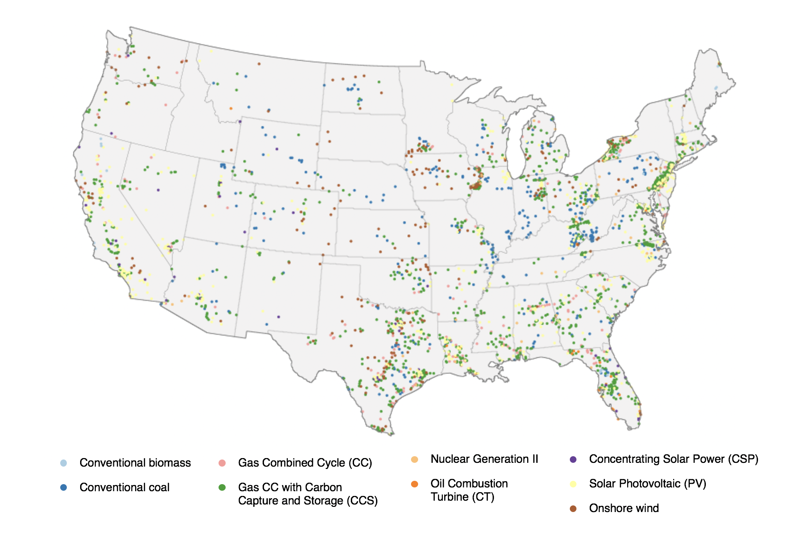

# Summary
Long-term electric power sector planning and capacity expansion is a key area of interest to stakeholders across a wide range of organizations because it helps in making informed decisions about investments in infrastructure within the context of potential future vulnerabilities under various natural and human stressors [@alova2020global; @craig2018review; @khan2021impacts]. Future power plant siting costs will depend on a number of factors including the characteristics of the electricity capacity expansion and electricity demand (e.g., fuel mix of future electric power capacity, and the magnitude and geographic distribution of electricity demand growth) as well as the geographic location of power plants [@eia2021lcoe]. Electricity capacity expansion plans modeled to represent alternate future conditions meeting a set of scenario assumptions are traditionally compared against historical trends which may not be consistent with current and future conditions [@iyer2015diffusion; @van2015comparing; @wilson2013future].

We present the `cerf` Python package (a.k.a., the Capacity Expansion Regional Feasibility model; CERF) which helps evaluate the feasibility and structure of future electricity capacity expansion plans by siting power plants in areas that have been deemed the least cost option while considering dynamic future conditions [Figure 1].  We can use `cerf` to gain an understanding of topics such as:  1) whether or not future projected electricity expansion plans from models such as GCAM-USA [@wise2019representing] are possible to achieve, 2) where suitability (e.g., cooling water availability) may influence our ability to achieve certain expansions, and/or 3) how power plant infrastructure build outs and value may evolve into the future when considering locational marginal pricing from a grid operations model.

{ width=75% }

# Statement of Need
`cerf` was originally published in @vernon2018cerf but was constrained in its ability to be utilized and extended due to a set of dependencies in the core module to a single version of an operating system that is now depreciated. The version of `cerf` described in this publication represents a complete rebirth of the fundamental methodology that was key to the original purpose of `cerf`.  This package now replaces the original design of wrapping a call to execute a pre-compiled C++ module with a Python-only approach that does not have operating system specific requirements. Major advancements were made to the performance of the software to enable `cerf` to be used in, and facilitate, large scenario exploration and uncertainty quantification experiments.  This effort has elucidated the internal decision-making structure of `cerf` and allows users to control key parameters that influence those decisions.  

Tools for identifying criteria for power plants and suitable energy corridors such as the Energy Zones Mapping Tool (EZMT, https://ezmt.anl.gov/) provide a valuable resource assessment for U.S. but do not address the influence of regional economics on siting and allow for forward projections. To the best of our knowledge, `cerf` is the only forward looking power plant siting open-source software that incorporates scenario-driven electricity expansion plans for renewable and non-renewable technology portfolios, zonal locational marginal pricing from grid operations models, an extensive suite of technology-specific suitability spatial data, and employs an economic algorithm to site power plants by least cost at a resolution of 1 km2.

# Functionality
`cerf` currently operates at a 1 km2 resolution over the conterminous United States.  Each grid cell is given an initial value of suitable (0) or unsuitable (1) based on a collection of suitability criteria gleaned from the literature.  CERF's default suitability layers include both those that are common to all thermal technologies as well as technology-specific suitability criteria [@vernon2018data].  Common suitability layers include categories such as protected lands, critical habitat areas, and much more.  Technology-specific suitability layers are those that satisfy requirements that may not be applicable to all technologies.  For example, minimum mean annual flow requirements for cooling water availability for individual thermal technologies.  

We introduce a metric named Net Locational Cost (NLC) that is used compete power plant technologies for each grid cell based on the least expensive option.  NLC is calculated by subtracting the Net Operational Value (NOV) of the proposed power plant from the cost of its interconnection to the grid to represent the potential deployment value.  Both the NOV parameter which incorporates many technology-specific values such as variable operations and maintenance costs, carbon price, heat rate, etc. and the interconnection cost parameter used for both electricity transmission infrastructure and gas pipelines have variables that are accessible to the user for modification per time step.

## Required Inputs
The `cerf` package comes equipped with sample data to get the user up-and-running very quickly.  This data is purely illustrative and not meant to be used to conduct research; but is meant for use to demonstrate the functionality of `cerf`.  The following describes the types of inputs needed to conduct research with `cerf`.

### Suitability Data

Suitability rasters are required for each technology that `cerf` attempts to site.  Each raster represents grid cells that are either suitable (value 0) or unsuitable (value 1).

### Electricity Capacity Expansion Plan

Expansion plans are generally generated by forward looking models that aim to model what future energy system build outs may look like in the future.  Models such as GCAM-USA [@wise2019representing], also can provide important technology-specific data that may accompany these projections from both exogenous and endogenous sources.  Endogenous data may evolve over time providing a dynamic representation of technology characteristics into the future.  Though not required by `cerf`, an expansion plan that requires only new vintage per time step is highly desirable to capture the behavior of real-world siting.  Additionally, `cerf` makes the assumption that an expansion provided for a target year is meant to come online in the same time step which places onus of planning and construction time considerations on the parent model.

- `expansion_plan.yml`:  This is the electricity capacity expansion plan that contains a U.S. state-level, technology specific expansion for the expected number of sites.

### Technology-specific Data

Fill in.

### Locational Marginal Pricing

Locational Marginal Pricing (LMP) is the price of electricity when considering fluctuations in supply and demand due to congestion and losses across the power grid.  LMPs ultimately represent the cost of making and delivering electricity (citation).  `cerf` uses LMPs as generated from a grid operations model at a zonal spatial resolution for 8760 hourly.

### Transmission Infrastructure

Fill in.

# Acknowledgements
This research was supported by the U.S. Department of Energy, Office of Science, as part of research in MultiSector Dynamics, Earth and Environmental System Modeling Program. The Pacific Northwest National Laboratory is operated for DOE by Battelle Memorial Institute under contract DE-AC05-76RL01830. The views and opinions expressed in this paper are those of the authors alone.

# References
